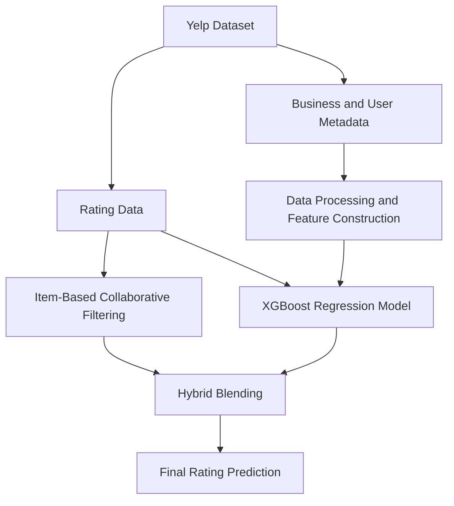

# Hybrid Recommendation System

This project implements a hybrid recommendation system that combines item-based collaborative filtering with a gradient boosted regression model (XGBoost) to predict user ratings for businesses in the Yelp dataset.

The system is designed as an end-to-end machine learning pipeline. PySpark is used for scalable data ingestion and feature extraction from multiple large Yelp datasets (users, businesses, check-ins, photos, and reviews). These engineered features are then used to train a supervised learning model, while an item-based collaborative filtering component captures user-item interaction signals derived from historical rating behavior.

The final prediction is generated through a weighted ensemble of the two models to leverage the strengths of collaborative filtering and feature-based learning.

---

## Problem Motivation

Recommendation systems are a core component of many modern platforms such as streaming services, marketplaces, and review platforms. They help users discover relevant items from large catalogs and improve user engagement.

However, building accurate recommendation systems presents several challenges:

• Sparse user–item interaction data  
• Cold-start issues for new users or items  
• Complex relationships between user behavior and item attributes  

To address these challenges, this project explores a hybrid recommendation architecture that combines item-based collaborative filtering with feature-based machine learning models. By integrating collaborative signals with structured metadata features, the system aims to improve prediction accuracy and robustness.

---
## Dataset

This project uses a subset of the **Yelp Open Dataset**, a publicly available dataset containing Yelp's business metadata, user profiles, reviews, tips, check-ins, and photos.

For model development, the interaction data was split into:
- Training set: 455,854 user–business rating records
- Validation set: 142,044 records
- A separate held-out test set was used in the original course setting but was not publicly released


More details about the dataset can be found in the [Yelp Open Dataset](https://business.yelp.com/data/resources/open-dataset/)

Due to GitHub file size limitations, the dataset is **not included in this repository**.  
Please download the dataset from the link above and place the files under the `data/` directory before running the pipeline.

---

## System Architecture

The system follows a hybrid recommendation architecture with two parallel prediction pipelines.

Historical user–business rating data is used to build an item-based collaborative filtering component that captures behavioral similarity between businesses. In parallel, structured signals are extracted from Yelp interaction and metadata sources to train a model-based ranking component. The final prediction is produced by blending the outputs of both models.


---

## Feature Engineering
Feature engineering is performed using PySpark to efficiently process large Yelp datasets.

The main feature groups include:

#### User Features
Extracted from `user.json`:
- review count
- average rating
- number of fans
- useful / funny / cool votes
- elite status indicator
- user tenure (years since joining Yelp)
- compliment counts

#### Business Features
Extracted from `business.json`:
- business rating
- review count
- price range
- open status
- geographic coordinates (latitude / longitude)

#### Business Attribute Features
Derived from business metadata:
- outdoor seating
- bike parking
- good for kids
- has TV
- delivery availability
- reservations
- takeout
- noise level
- restaurant attire

#### Category and Location Encoding
- Top 15 most frequent business categories
- Top 10 most frequent cities

#### Activity Signals
Derived from `checkin.json` and `photo.json`:
- check-in counts
- photo counts

#### Interaction Features
Several cross features are constructed to capture user-business interactions:
- user average rating × business rating
- user review count × business review count
- user useful votes × business TV availability
- price range × user fans
- delivery availability × street parking availability

---

## Modeling Approach

The recommender system combines two complementary modeling strategies: collaborative filtering and feature-based supervised learning.

### 1. Item-Based Collaborative Filtering

The collaborative filtering component uses an item-based approach, where similarity is computed between businesses based on historical user rating patterns.

For a target user–business pair, the prediction is generated by aggregating the user’s ratings on similar businesses they have previously interacted with. This method captures item–item relationships from collective user behavior and is typically more stable and scalable than user-based collaborative filtering.

### 2. Gradient Boosted Model

The model-based component uses a gradient boosted decision tree model trained with XGBoost. The model is trained on engineered user, business, and interaction features derived from the Yelp dataset. 

This model captures non-linear relationships between users and businesses that collaborative filtering alone cannot model. Gradient boosted trees are particularly effective for this task because they can handle heterogeneous feature types and learn complex feature interactions from structured data.


### 3. Hybrid Recommendation

The final prediction combines collaborative filtering and the model-based approach using a weighted ensemble:

```text
final_score = α * CF_prediction + (1 − α) * model_prediction
```

The blending weight α was selected based on validation performance. Empirical experiments showed that α = 0.1 produced the lowest RMSE.

---

## Evaluation

The hybrid model improved RMSE from **1.09** for the collaborative filtering baseline to **0.9746** for the final hybrid system.

This represents a significant improvement in prediction accuracy and ranked within the **Top 10 among 120+ teams** in the original project setting.

---

## Repository Structure

```text
hybrid-recommendation-system/
├── data/               # dataset files (not included in repository)
│   ├── business.json
│   ├── checkin.json
│   ├── photo.json
│   ├── review_train.json
│   ├── tip.json
│   ├── user.json
│   ├── yelp_train.csv
│   └── yelp_val.csv
├── scripts/
│   └── run_pipeline.py
├── src/
│   ├── collaborative_filtering.py
│   ├── data_loader.py
│   ├── evaluation.py
│   ├── feature_engineering.py
│   ├── hybrid.py
│   ├── model_training.py
│   └── utils.py
├── requirements.txt
└── README.md
```
---

## Tech Stack

```text
Python 3.6  
PySpark  
XGBoost   
NumPy  
```

---

## Prerequisites

```text
Python 3.6  
JDK 1.8  
Scala 2.12  
Apache Spark 3.1.2
```

---

## Quick Start

### Install dependencies

```bash
pip install -r requirements.txt

```

### Run the pipeline

```bash
python scripts/run_pipeline.py <data_folder> <test_file> <output_file>

```
Example:
```bash
python scripts/run_pipeline.py data/ data/yelp_val.csv output/predictions.csv
```

---

## Future Improvements

Several extensions could further improve the system:

• Two-tower neural architectures for scalable candidate retrieval  
• Embedding-based user and item representations  
• Multi-stage recommendation pipelines (retrieval + ranking)  
• Online learning using implicit user feedback  

---

### Author Contribution

All code in this repository was written solely by the author, Spencer Hu, unless otherwise noted.  